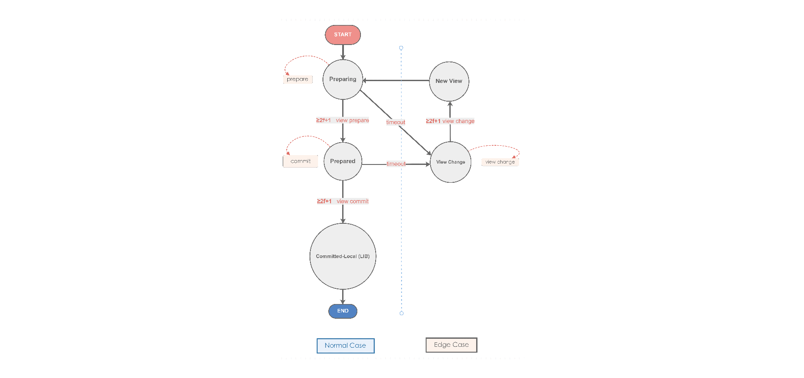

# BOSCore Technical White Paper

**Sep. 2018**

# Background 

The emergence of EOS has brought new imagination to the blockchain. In just a few months since the main network was launched, the version has undergone dozens of upgrades, not only the stability has been greatly improved, but also the new functions have been gradually realized. The node team is also actively involved in building the EOSIO ecosystem. What is even more exciting is that EOS has attracted more and more development teams. There are already hundreds of DApp running on the EOS main network. The transaction volume and circulation market value far exceed Ethereum, and the space for development is growing broader. 

During the gradual development of the EOS main network, we found some deviations from expectations. As the most competitive third-generation public chain, we look forward to seeing more and more applications running on EOS. Developers will use EOS as their preferred platform for application development. But due to the limitations of the current EOS resource model, higher cost of use including creating more accounts for users and deploying operating DApp. The key technology IBC needed for the millions of TPS to be realized in the white paper has not been promoted. The main network has repeatedly experienced insufficient CPU computing resources, which has intensified the urgency of the demand for cross-chain communication. In addition, due to the Pipeline-DPOS consensus algorithm adopted by EOSIO, a transaction takes nearly three minutes to ensure that it cannot be changed. Although it is much better than Bitcoin and Ethereum, it also brings restrictions to a lot of EOS application scenarios. Fast payment can only focus on small transfers, large transfers must wait long enough to ensure that they cannot be changed, which limits the payment experience of users on the chain and under the chain. 

In addition to the above mentioned, there are many other improvements that have been actively discussed in our community. From this, we feel that we should try more on EOS and let more developers or teams participate in the construction of EOSIO ecosystem. we will together make efforts for the blockchain to land in different scenarios in different industries. As a fully community-maintained EOS side chain, BOS will make more attempts based on its inherited good functions and will feed back to the EOSIO ecosystem its proven new features and functions.

# Overview 

BOS is committed to providing users with easy-to-access and easy-to-use blockchain services, providing a more user-friendly infrastructure for DApp operations, working to support richer application scenarios, and actively experimenting with DApp booms. In addition to technical improvements, BOS will also try other aspects. For example, in order to increase the participation of users in voting, estimator technology can be used to motivate accounts that meet clear rules. The rewards of BP on BOS will be adjusted according to the number of DApp on the chain, TPS, market value, liquidity and other indicators. Each BP is an encouragement for providing more resources for the ecology. A resolution reached by a community referendum will be coded as much as possible, to reduce human factors in the process, keep the process on chain, and maintain fairness and transparency. 

The codes of the BOS chain are fully contributed and maintained by the community. Each ecological participant can submit codes or suggestions. The related process will refer to existing open source software, such as PEP (Python Enhancement Proposals). 

In order to encourage the development of DApp in BOS, the BOS Foundation will provide Token replacement of low-cost resource mortgage services for DApp in BOS, reduce the operating costs of DApp in the early stage; in addition, it will also regularly provide BOS incentives to developers who contribute on a regular basis in order to establish a mutually reinforcing community development trend. 

# Consensus Algorithm 

EOSIO uses a pipelined Byzantine Fault Tolerance system. For a block, Propose, Pre-Commit, Commit, Finalize [1] are required stages. The last unchangeable block will be marked by Last Irreversible Block (LIB). A transaction basically takes about 3 minutes (the theoretical minimum is 325 block time, that is, 162.5 seconds) to enter LIB, although the transaction reliability time is much higher than other digital certificates such as BTC and ETH. However, there are still many limitations for many application scenarios. For example, the payment scenario, because it is not immediately determined whether the transaction is successful at the end, it takes a period of time to complete the transaction of the commodity, which adds a lot of restrictions. 

The reason for the long confirmation time for transactions is in the DPOS BFT consensus algorithm, the acknowledgment information after all blocks are synchronized will only be broadcast when it is the turn of the node. For example, in the case where BP1 is to produce block (the block is BLKn) and BP1~BP21 take turns to produce the block, BP2~BP21 will receive and verify BLKn one by one. However, all BPs can only wait until their turn to produce block then they can send a confirmation message about BLKn. 

After analyzing the problem of the EOSIO consensus algorithm, in order to shorten the time when a transaction becomes unchangeable, BOS will use PBFT (Practical Byzantine Fault Tolerance [2]) instead of Pipelined BFT. In this way, BP is able to confirm the blocks currently. The confirmation of block in real time enables the entire system eventually to reach a near real-time consensus speed. 

The BOS consensus algorithm is based on the PBFT theory, combined with the EOSIO code to improve, under the premise of guaranteeing Byzantine fault tolerance, the following changes will be made: 
1. The mechanism of the Pipelined BFT's BP round outflow block is retained, and the synchronous clock and the block orders are strongly constrained like EOS.
2. Remove the logic of the Pipelined BFT Consensus section by removing the implicit confirm and (explicit) confirm sections from the original block to avoid conflicts with PBFT consensus results in edge cases.
3. Consensus communication mechanisms using existing p2p networks will use the PBFT mechanism to broadcast prepare and commit information and ensure communication costs are within acceptable limits.
4. The batch consensus is used to replace the requirement of consensus for each block in PBFT, and the ideal information of real-time BFT is approached and the network load is reduced by broadcasting related information of multiple blocks at a time. 

The status of the BOS PBFT is described as follows:
- **Pre-prepare**, indicating that after a block is produced, it is broadcasted to all other producing nodes in the network. It can be analogized to BP in EOSIO and broadcast to the whole network.
-  **Prepare** means that a producing node will broadcast the request to the entire network after receiving the request. It can be analogized to broadcast the received information after all the nodes in EOSIO receive the block and verify successfully.
-  **Commit** means that a producing node receives enough prepare messages for the same request and broadcasts the request to the entire network. It can be analogized to the node in EOSIO receives enough prepare messages for the same block, and proposes a proposed lib message.
-  **Committed-local** means that a producing node receives enough commit messages for the same request and completes the verification. It can be analogized to LIB promotion in EOSIO.
-  **View** change means that a producing node loses the trust of other nodes for various reasons, the process of the whole system changes the producing node. Since EOSIO adopts the Pipelined BFT algorithm, all BPs are determined in advance by voting. Within one BP schedule, the order of the whole system is completely unchanged. When the network is in good condition and the producing node has not changed, it can be considered that there is no view change state. After the introduction of PBFT, in order to avoid the fork which may cause the consensus cannot advance, the view change mechanism is introduced. All unconsented information is discarded and consensus procedures are continually tried until the consensus is made.
-  **Checkpoint**, which refers to the recording of consensus evidence at a block height to provide a proof of security. This checkpoint is considered stable when there are enough producing nodes with the same checkpoint. The generation of checkpoint consists of two major categories: one is fixed k block generation, and the other is a special point that needs to provide security proof, such as a block in which the block BP schedule changes.

 

Through observation of the existing EOS main network, the network delay between the global nodes is mostly within 1 second. According to the consensus algorithm of BOS PBFT, 3 seconds to achieved unchangeable in most scenarios (pre-prepare, prepare, commit). Shortening the trusted time of a transaction from minutes to seconds will allow many scenarios to be implemented on the BOS chain. 

# Interchain Communication 

In the EOSIO technology white paper, interchain communication is used as a solution for high-concurrency and to construct flow channels between multiple chains. The overall ecological carrying capacity of EOSIO is increased by horizontal expansion. The essential issue of cross-chain communication is to justify the credibility of transactions between various chains. Heterogeneous blockchain systems (such as EOS, ETH) have great differences in block generation speed, internal data structure, and consensus mechanism. Therefore, the implementation of heterogeneous decentralized cross-chain is relatively difficult. It is more practical to verify transactions between different chains based on EOSIO. 

The basis for decentralized cross-chain communication is Light Weight Client and SPV/Simple Payment Verification. The Light Weight Client is a chain consisting of block heads, excluding the block bodies, so the Light Weight Client only takes up very little space. the SPV technology uses the merkle path to prove whether a transaction exists in a certain block [3]. 

The advantages of BOSCore cross-chain scheme are as follows: 
1. Completely Decentration. The Light Weight Client is implemented in the smart contract. When the correct starting block information is initialized, the contract can fully verify the validity of all subsequent blocks without relying on the trust of the relay or contract external information.
2. Light Weight. The Light Weight Client does not need to continuously synchronize all the block heads of the original chain, and only needs to synchronize a part of the segment of the blockchain to obtain a trusted block for verifying the transaction.
3. Fast Cross-chain Transactions. A cross-chain transaction takes less than 3 minutes from the generation to the conduction of corresponding transaction on the target chain.
4. Parallel Cross-chain Transactions. Different cross-chain transactions do not affect each other and can be executed in parallel, thus supporting a large number of concurrent transactions.
5. Safe. Due to the producer signature verification and strict logic check, the correctness of the Light Weight Client itself can be guaranteed and it cannot be maliciously attacked, so the authenticity of the transaction can be verified safely.

BOS provides a redemption channel with the EOS main chain based on the IBC scheme. EOS can be easily circulated between the BOS side chain and the EOS main chain, including other high-quality digital certificates on the EOS; similarly, BOS will advance to establish circulation channels with other EOSIO-based sidechains. And the entire EOSIO ecosystem begins to move into an ecological network. BOS will serve as a core circulation link to accelerate the development and evolution of the entire EOSIO ecosystem. 

# Pegged Coin 

In order to enrich the economic ecology of the entire chain, in addition to using the IBC mechanism to establish a distribution channel with the EOSIO main network, BOS will also adopt the “Notary Schemes” to map BTC and ETH to the BOS chain in conjunction with the world's top exchanges. Through this trusted channel, both BTC and ETH can easily achieve cross-chain circulation on the BOS. This means that for DApp running on BOS, while supporting EOSIO ecology digital assets, digital assets under other consensus algorithms can also be supported. In addition, this method can also be used as a solution to improve the liquidity of some coins with low TPS. 

BOS will provide a mechanism for issuing 1:1 pegged coins for different digital passes and authenticate the identity of trusted intermediaries through BP multi-sign. Every trusted intermediary need to mortgage a certain BOS as a margin. Organizations or companies with strength and credibility can apply for “notary” status. When 25 of the top 30 BPs are passed, the pegged currency can be issued. 

# Accounts

## Guaranteed Minimum Resource

Since the EOS main network online, for ordinary holders, it is often the case that the transfer fails due to insufficient staked resources. In this case, users can only ask others for help, which resulting in poor users’ experience and lifting entry barriers. 

For a chain, the growth of active users will promote the development of the chain, and also promote the development of DApp on the chain, which is vital to the entire ecosystem. In order to solve this problem, the BOS chain makes an improvement. The free resource quota allocated to each user can be adjusted through the parameters of the chain, which is equivalent to the social security system on the BOS chain. In this way, the basic needs of most users' daily transfers can be met, and there is no need to worry about the inability to use the chain function for less initial resource collateral. For users with more usage requirements, resource usage beyond the minimum amount of coverage still needs to be delegated. 

## Free Accounts Creation by Red Packet

For the EOSIO main network, creating account costs is a problem that cannot be ignored. The BOS is aimed at enriching the DApp on the chain, so it also provides a solution to the cost of creating accounts for users. Referring to the example of handing out a red packet in real life, BOS will build a community-developed "red packet DApp" and will continue to provide a certain amount of free account creation by the BOS Foundation. Other DApp project parties or organizations can easily create accounts for users free of charge through red packets. The red packet DApp-related functions can be accessed through the official website or through the access points provided by each BP. 

# ThunderNode 
By improving the consensus algorithm, the reliability of a transaction on the BOS chain can be shortened to less than 3 seconds, which is still a bit different from the centralized system. Therefore, in order to satisfy this demand for near the center of the system, the BOS will provide a node that can reach the millisecond level of confirmation, called ThunderNode. 

Similar to Lightning Networks, most of ThunderNode's transactions are done within a local network, and ThunderNode will ensure that transactions are visible on the BOS chain and cannot be changed. Once the user decides to use a certain ThunderNode, they need to lock part of the balance. This part of the balance can only be used in the ThunderNode. When it is decided not to use, the remaining BOS can be unlocked and restored to normal use. Once a user chooses to use the ThunderNode and lock the balance, he or she needs to send the registration on the BOS chain and wait for it to take effect before he or she can start using it. 

The operators of ThunderNode are completely open to competition. There are no hard restrictions. Users can also choose in accordance with their own needs. ThunderNode providers can get rewards by charging a certain fee. 

# Enhanced Usability 

## Safer Random Number Scheme 

At present, the known random number schemes in EOSIO are basically combined with predictable multiple fields, such as blockid, timestamp, etc. as part of a random seed, and then combined with the user side, DApp side or directly generated by the DApp offline. This type of solution takes certain security risks, cannot reduce the dependence on the credibility of the DApp side, and cannot avoid some replay attacks (such as INLINE_ACTION form). In response to the above problem, BOS enables the block_extension feature and provides the bpsig_action_time_seed scheme. bpsig_action_time_seed not only prevents replay attacks, but also requires the signature private key of the BP node to be signed, and saves the generated seed into block_extension for other nodes to verify. 

Combined with bpsig_action_time_seed, a safer random number scheme involving users, nodes, and DApp parties can be constructed. Bpsig_action_time_seed is generated as follows:
bpsig_action_time_ seed = sign (BP _Sign _Key, F(block_timestamp,0.5) + global_action_sequence)
Note:
- BP_Sign_Key: The purpose of signing with a BP private key is to prevent others from a speculative calculation.
- F: The down integral function of block_timestamp by 0.5, and the BP adjustment timestamp is lowered to make the probability of speculation.
- Global_action_sequence: global action auto-increment flag, used to prevent INLINE_ACTION attacks.

## Oracle Machine  

The Oracle Machine is a concept introduced by the Turing machine model. Due to the problem of downtime and the incompleteness of mathematics, the introduction of this concept will get some results that standard Turing machines will not get. In the Turing machine it is deterministic, but the oracle machine that is introduced in the blockchain is difficult to obtain theoretically defined characteristics. The reason is that the blockchain itself is built on fault-tolerant logic, and the certainty of input is not required, and even deceptive behavior is allowed, which is why the blockchain builds up the Byzantine fault-tolerant structure. Therefore, the oracle machine of the blockchain is essentially different from the oracle machine of the traditional sense. 

In the face of untrusted oracle machine, the simple deterministic computing model is obviously powerless. For this reason, we try to introduce a system model of the game to solve these problems. In a nutshell, it is not simply to regard the Oracle machine as the information providing point of the system, but to regard it as participants of the game and the information used to construct the game model. And by introducing a penalty mechanism and a multi-round game mechanism to establish a credible commitment, the information selection mechanism of the multi-information point is used to reach the Schelling point, thereby improving the credibility of the information. In addition, by introducing an inspector and the joint reward and punishment mechanism, the prisoner's dilemma of providing information to the role further ensures credibility. 

Based on the above analysis, BOS will implement a set of oracle mechanism based on the game system model, broaden the application scenarios that DApp can involve, and make the blockchain technology combined with various scenarios in life. 

## Configurations on Chain

Some details of EOSIO are not precise enough, and the black and white list configuration is a good example. Due to the black and white list configuration problem, at least two frozen accounts are invalidated. BOS will put such public configuration information, such as black and white lists, on chain. BP will be valid after multi-signed, to avoid the failure of the configuration at some points due to other reasons and cause losses. BOS will not only focus on the development of important features, but will also do more in the basic details. 

## More Plugins 

For the need to monitor the specific transaction situation of an account, the solution is more complicated for the current EOSIO, and is often implemented by the kafka plugin. This is another feature that is really needed for DApp, wallets or exchanges. For functional points that are generally required, BOS will support it. BOS has a built-in Notify Plugin that provides a similar way to the History Plugin, enabling low-cost, fast access to account monitoring. 

In addition, BOS will integrate the excellent plugins in the community to reduce the cost of compilation and make it easier for developers to use. 

## Producing Schedule by Time Zone 

EOSIO currently uses the lexicographic order of the BP account name to produce blocks. From the actual operation effect, it often leads to multiple small forks: the last 2-4 blocks cannot be broadcast to the next block BP in time. In order to reduce the network delay between two BPs, BOS will use the time zone order to produce blocks, reduce the physical distance and avoid network jitter to cause small forks. 

BOS plans to build a network that uses dedicated lines to interconnect each node in addition to the normal connection network to ensure higher quality and low latency transmission of block data. 

## BOS Toolkit

One of the pursuits of BOS is to minimize the user's threshold of use and present it to users in an easy-to-use and easy-to-understand way. Therefore, BOS official website will provide a feature collection page, which mainly to transform BOS related features into users-usable interfaces, such as red packet, account managers and others. The positioning of the BOS Toolkit is not a wallet application, it improves the usability of the functionality on the chain, allowing good design works. 

### Account Manager 
EOSIO introduces a flexible account system that allows for relatively complex operations for different privilege levels and different actions. Although this mechanism can implement an operating system level account solution, it is still too technical and complicated for the user. BOS has made one more step in this regard, so that users can use it easily. 

Through the account manager, you can not only set limit for every deal and daily transfer by the active key of the account. For more advanced owner permissions, the user must not only input the correct password, but also answer the correct question before using or exporting. It is a rule that designed to help users understand account permissions and enhance their security awareness. 

### P2P Self-Discovery 

In the implementation of EOSIO, the connection with those nodes depends on the static configuration of the configuration file. As a whole, when a new node joins, only published information can be obtained from other places, but the published information cannot be guaranteed to be comprehensive and up-to-date, which will result in some node connection channels being biased and reduce the quality of the entire network. 

BOS has been enhanced at this point, and the configuration item can decide whether to set a node to be self-discovery. And subject to the overall limit of the maximum number of connections, even if only one of each team’s nodes has self-discovery, it will help establish a higher interoperability quality network between the nodes on the BOS chain. 

In order to reduce risks, a node only obtains connectable node information from existing nodes in the configuration file, and does not automatically create connections without restriction. 

### Payment Limit 

BOS fully considers the actual usage scenarios for ordinary users. For DApp or Scatter plug-ins, you need to import the active key of the account. This high-privilege private key can control all the balances of the account, which will be high-security risks for users.  

BOS enhances the system contract and provides an interface that can set maximum limit for the active key each day or each deal. Once the user has set a limit, the time they encounter a malicious DApp, they can minimize their losses. The active key user with the limit set can be relatively safe to import into the DApp, and then get a smoother payment experience, avoiding frequent calls to the wallet application for authorization. 

# Ecological Model 

## Issuance Method 

The initial supply of BOS is 1 billion. The breakdown is as follows:
- 100 million will be managed by the BOS Foundation (unlocked over 10 years)
- 100 million will be reserved for ecological incentives 
  - 10 million direct airdropped on EOS mainnet accounts
  - 20 million rewarded to excellent node and DApp team rewards
  - 70 million distributed for DApp user incentives
- 800 million BOS will be exchanges in batches on the mainnet BOS. 

The annual inflation is 2%:
- 1% for BP rewards
- 0.8% for developer rewards
- 0.2% for governance incentives. 

## Developer Rewards 

To decentralize development of the core protocol, 0.8% of annual inflation will be distributed to BOS core code developers.

Every 3 months, the top 50 block producers nominated by the community will vote on and rank 40 winners to get the awards:
- The top 10 will share 40% (4% each)
- Individuals ranked 11 to 20 will share 30% (3% each)
- The last 20 share the remaining 30% (1.5% each) 

The quarterly reward distribution will be preceded by releasing by a one-week public disclosure of the 40 nominated candidates. In case of reasonable objections by the community, the list will be re-evaluated. Each reward list will be recorded on chain.  

As BOS continues to develop, developer rewards will be appropriately adjusted by the community to accelerate for the evolution of BOS. 

## Governance Model 

In the process of the ecological development of the chain, each chain in the future can be understood as a “state”. Each chain will have its own unique governance model. Different governance models will lead everyone to different directions and cause competition among the chains, and let the developers and users choose the best model through the free market model. 

The governance model of BOS advocates "Code is the law." Ensuring the smooth development of DApp will be the highest priority for BOS. 

BOS issues an additional 0.2% per year for governance organizations or volunteers who help BOS holders to initiate arbitration. Anyone in BOS can issue arbitrations. The more support a proposal gets, the more reliable it is. If the arbitration takes effect, the governance organizations or volunteers can receive 2000 BOS governance award. 

There are two types of decision or arbitration for BOS: 1. Not less than 15 BPs agree, 2. Community referendum. There is no single ECAF institution in BOS governance. But more independent organizations or individuals are encouraged to conduct community governance. They can get community incentives for effective solutions or suggestions. 

Note: The effective standard (for example, no less than N BPs agree that the arbitration will take effect) may change with the ecological development of the BOS chain, and any changes must also be voted in accordance with current governance rules. 

## Economic Model 

BOS is a very meaningful attempt at the free market economy of the blockchain world. Due to the excessive intervention of the central bank in the market and the inability to maintain independence, the digital token represented by Bitcoin attempts to solve the unresolved issue in real economy through the hypothesis of a rational man with the concept of a completely free market. But when we look back at the history of modern economics, governance and freedom, fairness and efficiency are always in the process of mutual game and rebalancing. From the classical school that pursues the free market, to the Keynesian school that emphasizes government intervention, and then to the Austrian school that stresses returning to the market, no direction will be generalized, or will remain stable all the time. 

BOS hopes to balance the advantages and disadvantages of the BTC free market and the current over-governance of EOS through commercial development, while leveraging the advantages of efficiency and decentralization to truly realize the commercialization of the blockchain. 

The inter-chain communication functions supported by BOS will affect the operation of the entire blockchain industry. All kinds of digital assets can link traditional isolated digital assets into a network through inter-chain communication. Including BTC, ETH, EOS or other certificate assets can be traded and transferred on the BOS chain. BOS can be understood as a free port of digital currency. The fast trading system brought by BOS will give it a very impressive throughput. In addition, low account creation costs will attract merchants and applications from all over the world to settle in, thus prospering the entire BOS ecosystem and then feeding back the EOSIO ecosystem. 

When a user holds ETH, BTC and EOS at the same time, the user can import the above tokens into the BOS chain through the cross-chain channel, and create BOS-ETH, BOS-BTC, and BOS-EOS on the chain. We call such assets BOS assets. That is, users bring assets into the BOS Freeport. Users can conduct consumption, investment, entertainment and other activities in the free port of BOS. DApp developers can provide various services for users. In the process of service, BOS assets can be traded or transferred in different BOS accounts. Holders of BOS assets can circulate assets from the BOS chain back to the original BTC, ETH, and EOS chains through chain-chain communication at any time. 

As a resource, BOS will become the pricing unit and infrastructure platform of the entire Freeport. When multiple assets interact on the BOS chain, BOS will play the role of value media as British pound and the US dollar. 

For the first time in history, the Bank of England exchanged the full amount of gold with the British pound for the first time. The combination of the Roman law-based law and the formation of a good business atmosphere attracted the best resources of the world at the time and finally made London the International Financial Centre. BOS will also create a blockchain business center through a sound infrastructure and a good business atmosphere. 

# Conclusion 

The goal of BOS is to build an EOSIO ecosystem that supports more DApp and solve real-world problems using blockchain technology. From the perspective of the evolution of the blockchain, in addition to being the preferred base chain of DApp, BOS can also serve as a circulation chain for various heterogeneous chain coins or tokens, and as a free port in the blockchain world. BOS comes from the community and will develop better with a joint effort by the community. 

# References 
[1] [ DPOS BFT— Pipelined Byzantine Fault Tolerance ](https://medium.com/eosio/dpos-bft-pipelined-byzantine-fault-tolerance-8a0634a270ba)  
[2] [ Practical Byzantine Fault Tolerance ](http://pmg.csail.mit.edu/papers/osdi99.pdf)  
[3] [ Chain Interoperability ](https://static1.squarespace.com/static/55f73743e4b051cfcc0b02cf/t/5886800ecd0f68de303349b1/1485209617040/Chain+Interoperability.pdf) 

